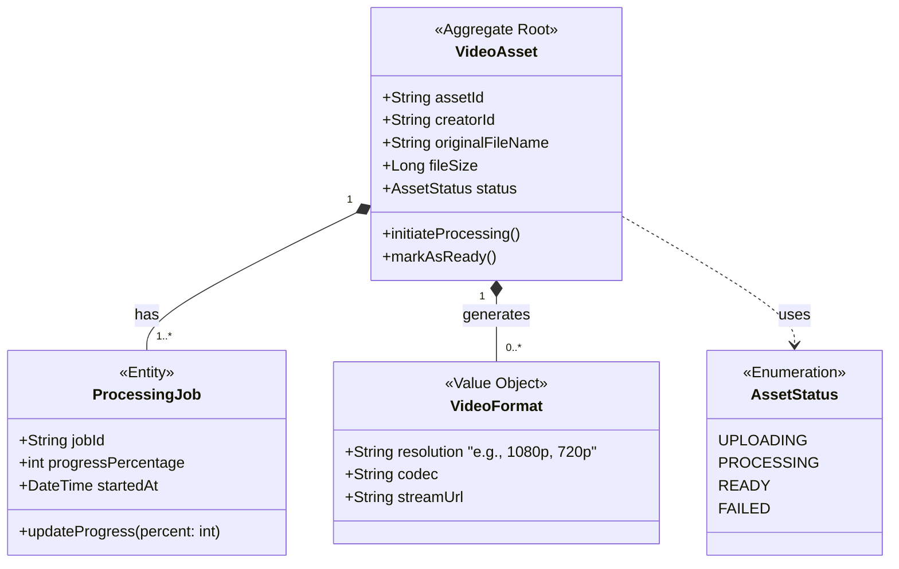

```mermaid
classDiagram
    class VideoAsset {
        <<Aggregate Root>>
        +String assetId
        +String creatorId
        +String originalFileName
        +Long fileSize
        +AssetStatus status
        +initiateProcessing()
        +markAsReady()
    }

    class ProcessingJob {
        <<Entity>>
        +String jobId
        +int progressPercentage
        +DateTime startedAt
        +updateProgress(percent: int)
    }

    class VideoFormat {
        <<Value Object>>
        +String resolution "e.g., 1080p, 720p"
        +String codec
        +String streamUrl
    }

    class AssetStatus {
        <<Enumeration>>
        UPLOADING
        PROCESSING
        READY
        FAILED
    }

    VideoAsset "1" *-- "1..*" ProcessingJob : has
    VideoAsset "1" *-- "0..*" VideoFormat : generates
    VideoAsset ..> AssetStatus : uses
```
