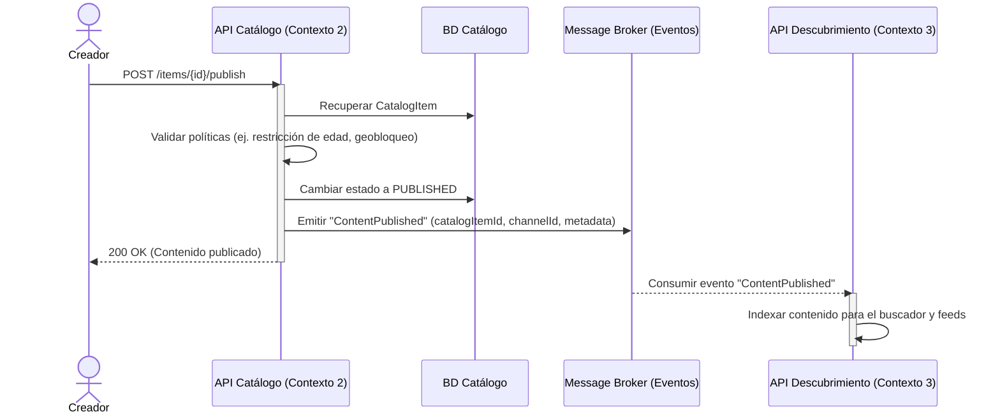

```mermaid
sequenceDiagram
    actor Creador
    participant API_Catalogo as API Catálogo (Contexto 2)
    participant DB_Catalogo as BD Catálogo
    participant EventBus as Message Broker (Eventos)
    participant API_Descubrimiento as API Descubrimiento (Contexto 3)

    Creador->>API_Catalogo: POST /items/{id}/publish
    activate API_Catalogo
    API_Catalogo->>DB_Catalogo: Recuperar CatalogItem
    API_Catalogo->>API_Catalogo: Validar políticas (ej. restricción de edad, geobloqueo)
    API_Catalogo->>DB_Catalogo: Cambiar estado a PUBLISHED
    
    %% Integración asíncrona clave
    API_Catalogo->>EventBus: Emitir "ContentPublished" (catalogItemId, channelId, metadata)
    
    API_Catalogo-->>Creador: 200 OK (Contenido publicado)
    deactivate API_Catalogo

    %% Consumo por otro contexto
    EventBus-->>API_Descubrimiento: Consumir evento "ContentPublished"
    activate API_Descubrimiento
    API_Descubrimiento->>API_Descubrimiento: Indexar contenido para el buscador y feeds
    deactivate API_Descubrimiento
```
