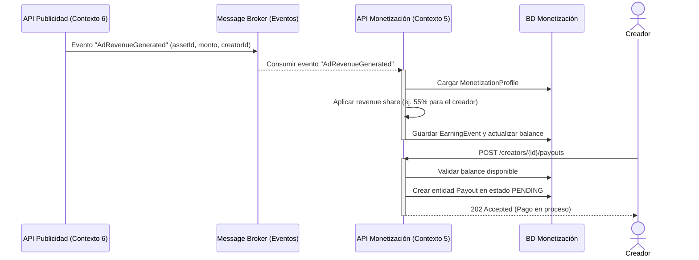

```mermaid
sequenceDiagram
    participant API_Publicidad as API Publicidad (Contexto 6)
    participant EventBus as Message Broker (Eventos)
    participant API_Monetizacion as API Monetización (Contexto 5)
    participant DB_Monetizacion as BD Monetización
    actor Creador

    %% Flujo Asíncrono de Ingreso
    API_Publicidad->>EventBus: Evento "AdRevenueGenerated" (assetId, monto, creatorId)
    EventBus-->>API_Monetizacion: Consumir evento "AdRevenueGenerated"
    activate API_Monetizacion
    API_Monetizacion->>DB_Monetizacion: Cargar MonetizationProfile
    API_Monetizacion->>API_Monetizacion: Aplicar revenue share (ej. 55% para el creador)
    API_Monetizacion->>DB_Monetizacion: Guardar EarningEvent y actualizar balance
    deactivate API_Monetizacion

    %% Flujo Síncrono de Retiro
    Creador->>API_Monetizacion: POST /creators/{id}/payouts
    activate API_Monetizacion
    API_Monetizacion->>DB_Monetizacion: Validar balance disponible
    API_Monetizacion->>DB_Monetizacion: Crear entidad Payout en estado PENDING
    API_Monetizacion-->>Creador: 202 Accepted (Pago en proceso)
    deactivate API_Monetizacion
```
