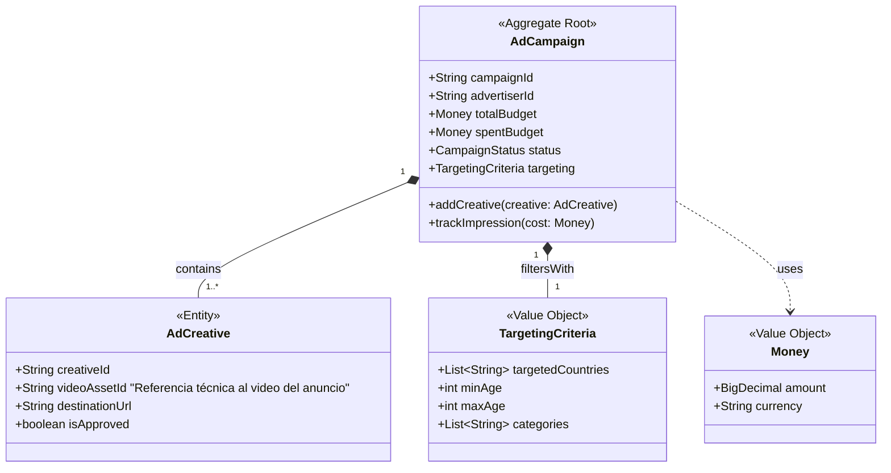

```mermaid
classDiagram
    class AdCampaign {
        <<Aggregate Root>>
        +String campaignId
        +String advertiserId
        +Money totalBudget
        +Money spentBudget
        +CampaignStatus status
        +TargetingCriteria targeting
        +addCreative(creative: AdCreative)
        +trackImpression(cost: Money)
    }

    class AdCreative {
        <<Entity>>
        +String creativeId
        +String videoAssetId "Referencia técnica al video del anuncio"
        +String destinationUrl
        +boolean isApproved
    }

    class TargetingCriteria {
        <<Value Object>>
        +List~String~ targetedCountries
        +int minAge
        +int maxAge
        +List~String~ categories
    }

    class Money {
        <<Value Object>>
        +BigDecimal amount
        +String currency
    }

    AdCampaign "1" *-- "1..*" AdCreative : contains
    AdCampaign "1" *-- "1" TargetingCriteria : filtersWith
    AdCampaign ..> Money : uses
```
