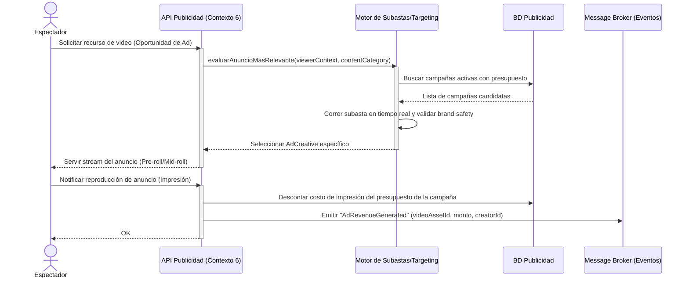

```mermaid
sequenceDiagram
    actor Viewer as Espectador
    participant API_Publicidad as API Publicidad (Contexto 6)
    participant AdEngine as Motor de Subastas/Targeting
    participant DB_Publicidad as BD Publicidad
    participant EventBus as Message Broker (Eventos)

    Viewer->>API_Publicidad: Solicitar recurso de video (Oportunidad de Ad)
    activate API_Publicidad
    API_Publicidad->>AdEngine: evaluarAnuncioMasRelevante(viewerContext, contentCategory)
    activate AdEngine
    AdEngine->>DB_Publicidad: Buscar campañas activas con presupuesto
    DB_Publicidad-->>AdEngine: Lista de campañas candidatas
    AdEngine->>AdEngine: Correr subasta en tiempo real y validar brand safety
    AdEngine-->>API_Publicidad: Seleccionar AdCreative específico
    deactivate AdEngine
    
    API_Publicidad-->>Viewer: Servir stream del anuncio (Pre-roll/Mid-roll)
    deactivate API_Publicidad

    %% El usuario ve el anuncio y genera una impresión facturable
    Viewer->>API_Publicidad: Notificar reproducción de anuncio (Impresión)
    activate API_Publicidad
    API_Publicidad->>DB_Publicidad: Descontar costo de impresión del presupuesto de la campaña
    
    %% Notificación asíncrona hacia el contexto de Monetización (Contexto 5)
    API_Publicidad->>EventBus: Emitir "AdRevenueGenerated" (videoAssetId, monto, creatorId)
    API_Publicidad-->>Viewer: OK
    deactivate API_Publicidad
```
